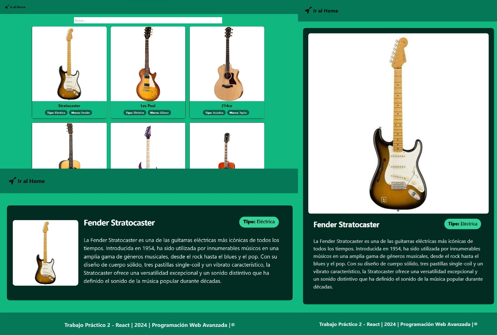

# :computer: PWA 2024

- **Trabajo Práctico 2: React**

> :guitar: **Dominio elegido:** Guitarras.

> En este proyecto se desarrolló una aplicación web utilizando React, implementando React Router para la navegación entre páginas, llamadas fetch para obtener datos de archivos locales JSON, y Tailwind CSS para estilizar la interfaz. La aplicación permite a los usuarios explorar una lista de elementos presentados en forma de tarjetas en la página de inicio, con la capacidad de ver detalles adicionales de cada elemento en una página separada al hacer clic en ellos. También se implemento una barra de búsqueda que filtra los elementos en las diferentes tarjetas visualizadas en la página principal.

## :office: Universidad Nacional del Comahue - Facultad de Informática

- **Carrera:** Tecnicatura Universitaria en Desarrollo Web
- **Materia:** Programación Web Avanzada
- **Año:** 2024

## :muscle: Integrantes (Grupo 8)

| Nombre                              |  Legajo    | Mail                                     | GitHub                                                      |
|:-----------------------------------:|:----------:|:----------------------------------------:|:-----------------------------------------------------------:|
| **Ferrada, Mauro**                  | FAI-4211   | mauro.ferrada@est.fi.uncoma.edu.ar       | [MauroFerrada](https://github.com/MauroFerrada)             |
| **Herrera, Julio Federico**         | FAI-4285   | julio.herrera@est.fi.uncoma.edu.ar       | [ELHACHESALTA](https://github.com/ELHACHESALTA)             |

## :bulb: Guía de instalación

1. Clonar el repositorio ejecutando en consola el comando: `git clone https://github.com/ELHACHESALTA/PWA.git`
    - Necesario tener instalado [git](https://git-scm.com/download/win)
2. Acceder a la carpeta del repositorio mediante el comando: `cd PWA`
3. Instalar las dependencias necesarias para el proyecto ejecutando el comando: `npm i`
    - Necesario tenes instalado [Node.js](https://nodejs.org/en/download/current)
4. Ejecuta la aplicación utilizando el comando `npm start`